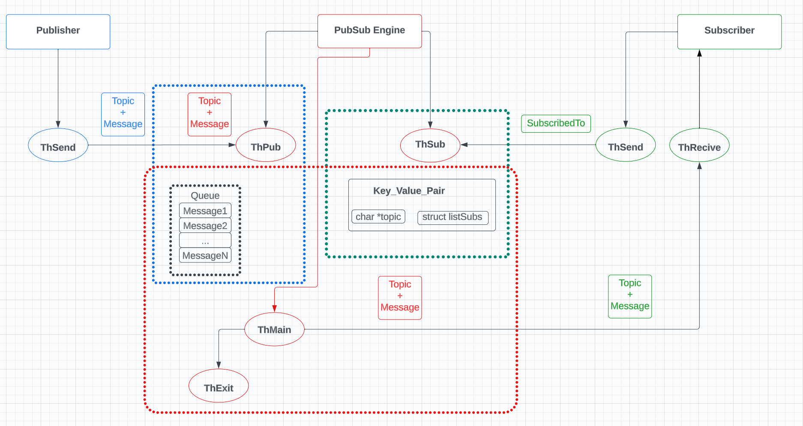

# Publisher-Subscriber Project in C

## Overview

This project implements a **Publisher-Subscriber** messaging architecture in C, where publishers send messages on specific topics, and subscribers receive messages by subscribing to those topics. The project enables efficient message exchange and distributed communication across multiple components using threads.

## Features

- **Publisher** sends messages (topics and corresponding data) using the `ThSend` thread.
- **Subscribers** receive messages after subscribing to specific topics using the `ThSub` and `ThReceive` threads.
- **PubSub Engine** manages the mapping between topics and their subscribed subscribers.
- **Message Queue** stores the messages to ensure they are processed and delivered asynchronously.

## Topics

The following topics are available for subscription:

1. **AnalogMer** – For receiving data related to analog measurements.
2. **StatusCbr** – Status information about a component, likely a breaker or device.
3. **StatusSwg** – Status information related to switching devices.

## Project Architecture

## Components

The system consists of the following key components:

### 1. **Publisher**

- The publisher generates and sends messages that consist of a **Topic** and a **Message**.
- The `ThSend` thread is responsible for sending the message to the **PubSub Engine**.

### 2. **PubSub Engine**

- The core of the system where topics and subscriber lists are managed.
- It contains a **Key-Value Pair** structure that maps a **Topic** (key) to a list of subscribers (value).
- Routes messages to the appropriate subscribers based on their subscriptions.

### 3. **Subscribers**

- Subscribers can subscribe to one or more topics using the `ThSub` thread.
- Once a message is published on a subscribed topic, the subscriber will receive it through the `ThReceive` thread.

### 4. **Message Queue**

- Messages sent by the publisher are placed in a queue to ensure asynchronous processing.
- The queue holds multiple messages, allowing the system to handle and deliver messages in the correct order and ensure all subscribers receive the data.

## How It Works

1. **Publisher sends messages:** A publisher sends a message by specifying a topic and the corresponding data. This message is placed in the queue by the `ThPub` thread.
2. **Subscribers subscribe to topics:** Subscribers express interest in specific topics by subscribing via the `ThSub` thread. The subscription is recorded in the **PubSub Engine**.

3. **Messages are distributed:** Once a message is published, the **PubSub Engine** routes the message to all the subscribers who are subscribed to that topic. The `ThReceive` thread handles the message reception on the subscriber's side.

4. **Exit and Cleanup:** When the system is done or a shutdown is requested, the `ThMain` thread handles the graceful shutdown of the system, ensuring all messages are processed, and then the `ThExit` thread cleans up.

## Participants

- Nemanja Mijonić PR 138/2020 [nemanjamijonic]
- Srđan Bogićević PR 139/20202 [blackhood10]
